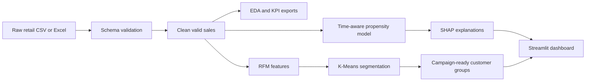

# Smart Retail Intelligence System

> A production-oriented retail analytics project that converts 1M+ transaction
> records into customer intelligence, revenue insights, and campaign actions.

## Portfolio highlight

Built an end-to-end, reproducible customer-intelligence pipeline on **1,067,371
retail transactions**. The system validates raw data, produces business EDA,
creates RFM customer features, evaluates K-Means segmentation, predicts future
purchases, explains predictions with SHAP, and exports action-ready outputs.

### Business results

| Metric | Result |
|---|---:|
| Valid sales revenue | 20.97M |
| Orders analyzed | 40,077 |
| Identified customers | 5,878 |
| Average order value | 523.31 |
| Champion customers | 1,117 |
| Champion revenue share* | 72.2% |

\*Share of revenue attributable to identified customers in the segmentation data.

## What it does



- Validates source schema and supports both modern Excel and legacy CSV headers.
- Flags cancellations and calculates transaction-level revenue.
- Exports revenue, order, country, product, and monthly trend analyses.
- Builds Recency, Frequency, and Monetary customer features.
- Compares cluster counts using inertia and silhouette score.
- Produces business-facing segments: Champions, Former High-Value, Potential Customers, and At Risk.
- Predicts 30-day purchase propensity with temporal train/test evaluation.
- Explains tree-model predictions with SHAP global and local feature contributions.
- Serves report outputs in a Streamlit dashboard and includes Docker deployment assets.

## Tech stack

Python · Pandas · NumPy · scikit-learn · pytest · Plotly · SHAP · Streamlit

## Dataset

Uses the [UCI Online Retail dataset](https://archive.ics.uci.edu/dataset/352/online-retail).
The project also supports its legacy CSV schema, used in this implementation.

Place the dataset at:

```text
data/raw/online_retail.csv
```

## Quick start

```powershell
python -m pip install -e ".[dev]"
python -m pytest -q
python scripts/run_eda.py --input data/raw/online_retail.csv --output reports/eda
python scripts/run_segmentation.py --input data/raw/online_retail.csv --output reports/segmentation --clusters 4
python scripts/train_purchase_model.py --input data/raw/online_retail.csv --output reports/modeling --model-path models/purchase_model.joblib
streamlit run app/dashboard.py
```

## Example insights

- The United Kingdom contributes roughly 85% of sales revenue.
- Revenue rises sharply from September through November, highlighting seasonal demand.
- Champions are only 19% of identified customers but generate about 72% of identified-customer revenue.
- The largest group is At Risk: low purchase frequency and roughly 393 days since last purchase. This group should receive low-cost reactivation rather than high-value incentives.

## Repository layout

```text
src/smart_retail/       Reusable ingestion, EDA, and segmentation code
scripts/                Reproducible command-line workflows
tests/                  Automated unit tests
docs/                   Module guides, interview questions, and portfolio notes
data/raw/               Local source data (ignored by Git)
reports/                Generated analysis outputs (ignored by Git)
```

## Current scope and roadmap

Implemented: ingestion, validation, EDA, RFM feature engineering, K-Means
segmentation, time-aware 30-day purchase prediction, model evaluation, SHAP
explainability, Streamlit dashboard, Docker packaging, and automated tests.

Recommended production enhancements: scheduled retraining, managed artifact
storage, access control, drift monitoring, CI/CD, and cloud deployment.

## Portfolio and interview material

Use [resume_showcase.md](docs/resume_showcase.md) for resume bullets, a
30-second project pitch, demo flow, and interview talking points.

## Learning modules

Each implemented module contains a plain-language code guide and interview
questions:

1. [Data ingestion](docs/module_01_data_ingestion.md)
2. [EDA](docs/module_02_eda.md)
3. [Customer segmentation](docs/module_03_customer_segmentation.md)
4. [Purchase prediction](docs/module_04_purchase_prediction.md)
5. [SHAP explainability](docs/module_05_shap_explainability.md)
6. [Dashboard and deployment](docs/module_06_dashboard_deployment.md)
